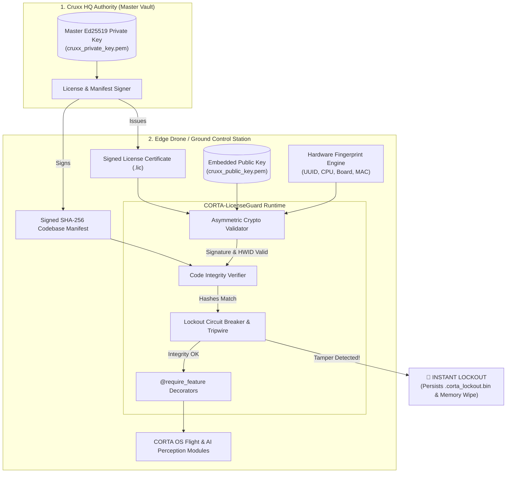

# 🛡️ CORTA-LicenseGuard: Defense-Grade Licensing & Anti-Tamper Engine

[](https://www.python.org/)
[](https://cryptography.io/)
[](#security-architecture)
[](#running-tests)
[](#)

> **Zero-Trust, Edge-First Licensing & Code Integrity Protection System** engineered specifically for **Cruxx Solutions** autonomous UAV platforms, Ground Control Stations (GCS), and **CORTA OS**.

---

## 📌 Overview

Modern autonomous unmanned systems and tactical drone platforms operate in **offline, electronic-warfare (EW) contested, and mission-critical environments**. Standard software licensing mechanisms that depend on cloud phone-home APIs, plain text serial keys, or weak obfuscation are completely unsuitable for defense and industrial operations.

**`CORTA-LicenseGuard`** is an edge-first, military-grade licensing and runtime anti-tamper security engine:
- **100% Offline / Air-Gapped Verification:** Operates with zero internet dependence using asymmetric cryptography.
- **Hardware-Locked Binding:** Cryptographically locks license certificates to unique physical machine/drone registers.
- **SHA-256 Codebase Integrity Guard:** Continuously audits codebases, configuration files, and compiled binaries against signed cryptographic manifests.
- **Fail-Secure Instant Tripwire Lockout:** If an adversary modifies even **1 single character of code**, decompiles modules, or rolls back system clocks, the engine **immediately hashes the incident forensics, wipes runtime keys from memory, and permanently locks the device** until an authorized Cruxx HQ recovery token is provided.

---

## 🏛️ System Architecture



---

## ⚡ Key Architectural Pillars

### 1. 🔑 Asymmetric Ed25519 Cryptography
- Cruxx HQ retains the **Master Private Key** (`cruxx_private_key.pem`) to issue licenses and sign code manifests.
- Drones and field workstations only store the **Public Key** (`cruxx_public_key.pem`).
- Digital signatures cannot be forged or cracked, even if an attacker completely disassembles the drone's public firmware.

### 2. 🔒 Cryptographic Hardware Binding (HWID)
- Extracts low-level machine identifiers (System UUID, CPU Processor ID, Motherboard Serial Number, and Primary MAC Address).
- Computes a salted cryptographic digest: `CRUXX-HW-XXXX-XXXX-XXXX-XXXX`.
- Prevents cross-drone license cloning and software piracy.

### 3. 🛡️ Signed SHA-256 Codebase Manifest
- Generates a canonical hash dictionary of all mission-critical scripts, neural network weights, configuration files, and compiled binaries.
- Encapsulates root Merkle-style hashing to detect added, modified, or missing files.

### 4. ⚡ Instant Fail-Secure Tripwire Lockout
- Detects unauthorized alterations in real-time.
- Encrypts and persists a tamper forensic record (`.corta_lockout.bin`) containing the incident timestamp, offending file hash, machine HWID, and a cryptographic challenge nonce.
- Automatically purges in-memory keys and raises `CruxxTamperLockoutError`, permanently refusing further execution.

### 5. 🔄 Challenge-Response Recovery Protocol
- Locked systems cannot be recovered by restarting or deleting files.
- The system generates an **Unlock Challenge Nonce**. Cruxx HQ validates the security incident and signs an authorized **Unlock Recovery Token** with its Master Private Key to safely restore operation.

---

## 🚀 Installation

### Option A: Using `uv` (Recommended - Ultra Fast)
```bash
# Clone the repository
git clone https://github.com/your-org/cruxx-license-engine.git
cd cruxx-license-engine

# Install dependencies and setup environment
uv sync
```

### Option B: Using standard `pip`
```bash
python -m venv .venv
source .venv/bin/activate  # On Windows: .venv\Scripts\activate
pip install -e .
```

---

## 🛠️ Command-Line Interface (`cruxx-guard`)

The engine provides a complete CLI tool for key management, licensing, codebase auditing, and recovery.

### 1. Inspect Device Hardware ID
```bash
uv run cruxx-guard hwid -v
```
```text
[+] Device Hardware ID: CRUXX-HW-CB6D-7D80-4306-9044
[-] Hardware Attributes:
    os: windows
    system_uuid: C93AFF74-EAA8-354B-A723-7B610EBD28CF
    processor_id: 178BFBFF00A70F52
    baseboard_serial: PLBBV00WBLY1RS
    mac: 0xf068e3ec39c1
```

### 2. Generate Cruxx HQ Master Keypair (HQ Only)
```bash
uv run cruxx-guard keygen --out-dir ./keys
```

### 3. Issue a Signed License Certificate
```bash
uv run cruxx-guard issue   --private-key ./keys/cruxx_private_key.pem   --customer "Strategic_Border_Wing_07"   --tier "DEFENSE_TACTICAL"   --hwid "CRUXX-HW-CB6D-7D80-4306-9044"   --features "corta_core,edge_ai_vision,bvlos_comms,anti_jam_protocol"   --days 365   --fleet-size 12   --output ./corta_client.lic
```

### 4. Create a Signed Codebase Integrity Manifest
```bash
uv run cruxx-guard manifest-create   --private-key ./keys/cruxx_private_key.pem   --dir ./corta_modules   --output ./corta_manifest.json
```

### 5. Verify Entire System & License Integrity
```bash
uv run cruxx-guard verify   --public-key ./keys/cruxx_public_key.pem   --license ./corta_client.lic   --manifest ./corta_manifest.json   --dir ./corta_modules
```

### 6. Check System Lockout Status
```bash
uv run cruxx-guard status
```

### 7. Authorized System Recovery (Challenge-Response)
```bash
# 1. On Locked Device: Generate Challenge File
uv run cruxx-guard unlock-challenge --output unlock_challenge.json

# 2. At Cruxx HQ: Validate incident and sign recovery token
uv run cruxx-guard unlock-resolve --private-key ./keys/cruxx_private_key.pem --challenge-file unlock_challenge.json --output recovery_token.json

# 3. On Locked Device: Apply recovery token to restore system
uv run cruxx-guard unlock-apply --public-key ./keys/cruxx_public_key.pem --token-file recovery_token.json
```

---

## 💻 Developer Integration (Python SDK)

### Protecting CORTA OS Modules with Feature Gates

```python
from cruxx_license import CORTALicenseGuard, require_feature

# 1. Initialize Guardian Engine on Drone Boot
guard = CORTALicenseGuard(
    public_key_pem_or_path="./keys/cruxx_public_key.pem",
    codebase_root_dir="./corta_modules",
    manifest_path="./corta_manifest.json",
    license_path="./corta_client.lic",
    lockout_file_path="./.corta_lockout.bin",
    auto_lockout_on_tamper=True  # Instantly lock device if tampering is detected
)

# 2. Perform Zero-Trust System Audit on Startup
guard.verify_all()

# Optional: Start background watchdog thread during flight (runs every 15s)
guard.start_watchdog(interval_seconds=15)

# 3. Gate Autonomous Capabilities
@require_feature("corta_core")
def engage_autonomous_navigation():
    return ">> [CORTA OS] Autonomous flight vector active. BVLOS link connected."

@require_feature("edge_ai_vision")
def run_perimeter_recon():
    return ">> [EDGE AI] AI Perception running locally on neural compute stick."

@require_feature("anti_jam_protocol")
def activate_ew_countermeasures():
    return ">> [ANTI-JAM] Frequency hopping active."
```

---

## 🎬 End-to-End Simulation Demo

Run the interactive live demo showcasing legitimate execution, simulated adversary code tampering, instant fail-secure lockdown, and cryptographic recovery:

```bash
uv run python examples/corta_drone_demo.py
```

---

## 🧩 Adding Custom License Attributes

The licensing engine is designed to scale with Cruxx's growing mission needs. You can easily attach operational, physical, and business constraints to the license payload:

```python
# In cruxx_license/licensing/schema.py:
payload = {
    "customer_id": customer_id,
    "tier": tier,
    "hardware_id": hardware_id,
    "valid_until": valid_until,
    "allowed_features": allowed_features,
    
    # Custom Mission & Drone Attributes:
    "max_altitude_meters": 120,            # Airspace regulation ceiling
    "max_flight_hours": 500,               # Maintenance lease limit
    "max_swarm_nodes": 8,                  # Swarm orchestration limit
    "geofence_bounding_box": {             # Operational boundary
        "lat_min": 18.50, "lat_max": 18.70,
        "lon_min": 73.80, "lon_max": 74.00
    },
    "clearance_level": "DEFENSE_RESTRICTED"
}
```

---

## 🧪 Running Tests

Execute the automated test suite with pytest:

```bash
uv run pytest -v
```

### Test Coverage Summary:
- ✅ `test_crypto_signing_and_verification`: Ed25519 signature validity and forgery rejection.
- ✅ `test_hardware_fingerprint`: Deterministic hardware hash extraction and matching.
- ✅ `test_license_creation_and_entitlements`: Feature gating and validity dates.
- ✅ `test_license_hardware_mismatch_rejection`: Cross-device piracy prevention.
- ✅ `test_code_integrity_manifest_and_tamper_detection`: Real-time SHA-256 file modification detection.
- ✅ `test_lockout_circuit_breaker_and_recovery`: Instant lockout tripwire and challenge-response recovery.
- ✅ `test_corta_guard_runtime_and_decorator`: End-to-end `@require_feature` decorator and runtime audit.

---

## 🔒 Security Threat Model

| Threat Scenario | Defense Mechanism | System Behavior |
| :--- | :--- | :--- |
| **Pirating software to another drone** | Hardware Fingerprint Binding | License rejection (`TAMPER_HARDWARE_MISMATCH`). System refuses to boot. |
| **Adversary modifies Python code / binaries** | SHA-256 Manifest Verifier | Root hash mismatch (`TAMPER_FILE_MODIFIED`). Instant lockout triggered. |
| **Injecting backdoor files into codebase** | Strict Untracked File Auditing | Untracked file detected (`TAMPER_FILE_UNTRACKED`). Instant lockout triggered. |
| **Manipulating system clock for expired license** | Monotonic Clock Check | Time rollback detected (`TAMPER_CLOCK_ROLLBACK_DETECTED`). Instant lockout triggered. |
| **Modifying `.lic` certificate payload** | Ed25519 Asymmetric Signature | Cryptographic signature verification fails (`TAMPER_LICENSE_SIGNATURE_INVALID`). |
| **Deleting `.corta_lockout.bin` after tamper** | In-Memory & HMAC Seal Verification | Memory remains tripped; seal validation fails (`CORRUPTED_TAMPER_SEAL`). |

---

## 🏢 Corporate Registry & Ownership

**Cruxx Solutions Private Limited**  
*At the Core of Innovation*  
Hinjawadi Infotech Park, Pune, Maharashtra - 411057, India  
- **Web:** [cruxxsolutions.in](https://cruxxsolutions.in)  
- **Contact:** info@cruxxsolutions.in  

---

## 📄 License

Confidential & Proprietary. Developed for Cruxx Solutions Private Limited and CORTA OS autonomous platforms. Unauthorized copying, distribution, or decompilation is strictly prohibited.